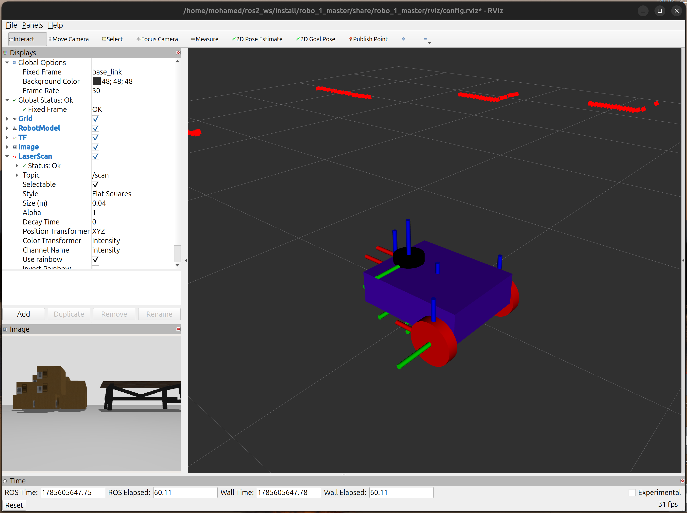

# robo_1
A ROS2 repo for learning ros2 basics (Node, publisher & subscriber, parameters, urdf), computer vision basics, gazebo sim, sensor integration, control.
in this project we created a mobile robot that has camera, lidar, tracking (openCV), control.

A ROS 2 mobile robot project focused on closing the **sense → think → act** loop: a camera and a lidar feed perception nodes, which drive a decision/control node that sends velocity commands to the base. Built and tested on ROS 2 Jazzy / Ubuntu 24.04.

<!-- 📸 MAIN HERO PHOTO OR GIF GOES HERE -->
<!-- Add an image or short gif of the finished robot / RViz view here, e.g.: -->
<!--  -->

## Overview

`robo_1` is split into two ROS 2 packages:

| Package | Description |
|---|---|
| [`robo_1_description`](robo_1_description) | URDF/xacro description of the robot: mobile base, camera, and lidar, plus a display launch file for visualizing the model in RViz/Gazebo. |
| [`robo_1_master`](robo_1_master) | C++ nodes that implement perception and control: color/object detection, visual aim tracking, lidar nearest-point detection, and velocity command publishing. |

### Robot model

The URDF is built from these xacro files in [`robo_1_description/urdf`](robo_1_description/urdf):
- `robo_1.urdf.xacro` – top-level robot description
- `mobile.urdf.xacro` / `mobile.gazebo.xacro` – mobile base + Gazebo plugins
- `camera.xacro` – camera sensor mount
- `lidar.xacro` – lidar sensor mount
- `common_properties.xacro` – shared materials/constants

<!-- 📸 URDF / RVIZ MODEL SCREENSHOT -->

<!-- Add a screenshot of the robot model loaded in RViz here, e.g.: -->
<!--  -->

### Nodes (`robo_1_master/src`)

| Node (executable) | Source file(s) | Purpose |
|---|---|---|
| `camera` | `camera.cpp`, `aim_tracker.cpp/.h` | Subscribes to the camera image topic, runs OpenCV-based color detection to find a target, and publishes its position. |
| `check_distance` | `check_distance.cpp` | Subscribes to `/scan` (lidar) and publishes the closest detected point/distance. |
| `controller` | `control.cpp` | Subscribes to command input and publishes `geometry_msgs/Twist` on `/cmd_vel` to drive the robot. |
| `main_brain` | `main_brain.cpp` | Central decision node intended to tie perception (camera/lidar) output to control commands — currently a work in progress. |
| `publisher` | `publisher.cpp` | Minimal example publisher (`/min_publisher`) used for testing. |
| `minimal_param_node` | `minimal_parameter.cpp` | Minimal example node demonstrating ROS 2 parameters. |

## Prerequisites

- Ubuntu 24.04
- ROS 2 Jazzy
- Gazebo (via `ros_gz_sim`, `ros_gz_bridge`)
- OpenCV, `cv_bridge`, `image_transport`
- `xacro`, `robot_state_publisher`, `rviz2`

## Build

```bash
# From the root of your ROS 2 workspace (e.g. ~/ros2_ws)
cd ~/ros2_ws/src
git clone https://github.com/Eng-Mohamed-Yasser-5/robo_1.git

cd ~/ros2_ws
rosdep install --from-paths src --ignore-src -r -y
colcon build --symlink-install
source install/setup.bash
```

## Running

Visualize the robot model:

```bash
ros2 launch robo_1_description display.launch.xml
```

Launch the full stack (robot state publisher, Gazebo, gz bridge, RViz):

```bash
ros2 launch robo_1_master display.launch.xml
```

Run individual nodes for testing:

```bash
ros2 run robo_1_master camera
ros2 run robo_1_master check_distance
ros2 run robo_1_master controller
ros2 run robo_1_master main_brain
```


<!-- 🎥 DEMO VIDEO / GIF GOES HERE -->
<!-- Add a short demo clip of the robot detecting/tracking a target and moving, e.g.: -->
<!-- [](media/videos/demo.mp4) -->
<!-- GitHub doesn't play mp4 inline in README — either link to it like above, -->
<!-- upload it as a GitHub "issue/PR" attachment and paste the generated link, -->
<!-- or host it on YouTube and embed a thumbnail that links out. -->

## Project status / roadmap

This is an active, in-progress project. Current focus areas:

- [ ] Implement visual servoing (proportional controller) so `camera` output drives `controller` in closed loop
- [ ] Wire up `main_brain` so it actually consumes camera + lidar output and issues commands
- [ ] Resolve parallax offset between the camera and lidar frames
- [ ] Clean up `aim_tracker.h`/`aim_tracker.cpp` (remove unused globals, fix header include order)
- [ ] Resolve macro/`using namespace` confusion in `camera.cpp`

## Repository structure

```
robo_1/
├── robo_1_description/       # URDF/xacro robot model
│   ├── urdf/
│   └── launch/
├── robo_1_master/            # Perception + control nodes
│   ├── src/
│   ├── launch/
│   ├── config/
│   └── rviz/
└── media/                    # 📷🎥 put photos/videos referenced in this README here
    ├── photos/
    └── videos/
```


